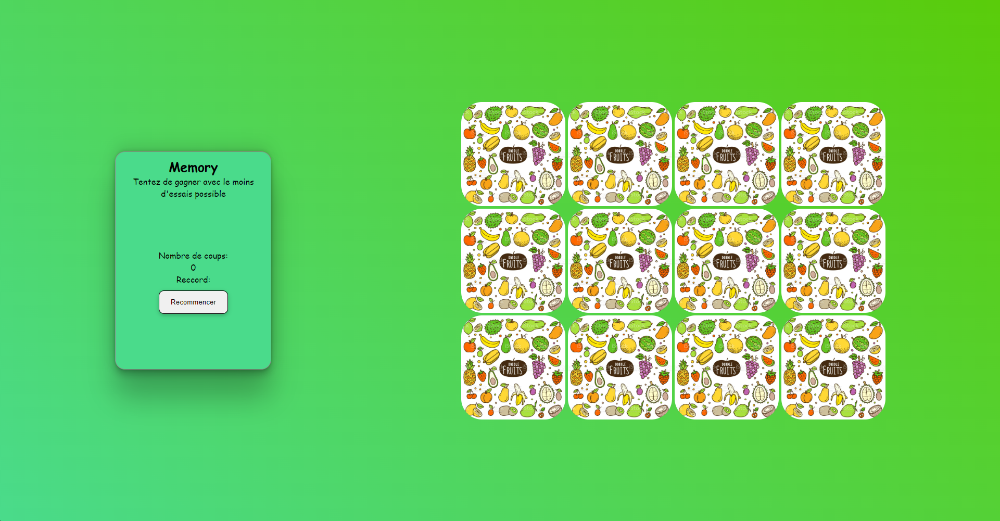
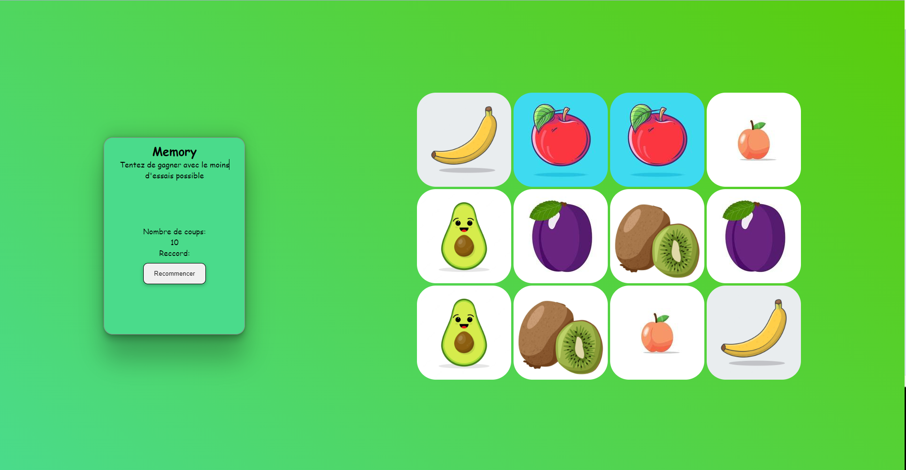

# Memory

## Fr

### Description

Jeux de mémory avec possibilité de recommancer et mémoriser le meilleur score.

### Détails

Petit jeu memory pour pratiquer le javascript.
J'ai utilisé backface visibility pour obtenir des cartes avec du contenu sur les deux faces.
On créer 1 conteneur pour la carte avec 2 éléments images à l'intérieur comme face. On superposer les deux faces puis on applique backface-visibility: hidden sur les deux puis on rotate l'une d'elle de 180deg. Maintenant notre carte est prête, on a juste à appliquer un fonction onclick qui permet de rotate de 180deg notre carte.
Un des défis de ce projet est de placer aléatoirement les cartes sur le plateau de jeu. Pour ça j'ai créer deux tableau, le premier qui contient les images puis le second pour accueillir les images choisis dans le premier aléatoirement. Ensuite je génère un nombre aléatoire avec Math.random, puis je vérifie si l'image n'est pas présente dans le second tableau, s'il ne l'est pas alors je push l'image à index du nombre généré dans le second tableau, puis je répète le processus jusqu'à ce que le second tableau ai les mêmes images que le premier. Maintenant le second tableau à les images du premier tableau mais placé de manière aléatoire.

Le jeu est dispo [ici](https://seblau02.github.io/Memory/)

## En

Memory game, tiny project to practice in javascript.
Backface visibility is the key in this project. One container as card with 2 element as faces, one as front card and the other as card backface. Then I overlaid the faces and applied backface visibility: hidden on each of them. However we must rotate one of our face by 180deg. Here our card is ready. Add an function at onclick to rotate the card by 180deg to reveal the backface.
One of the challenge in this project is the function that randomly place the cards on the game board. To do it I placed fruits pictures in an array (first) and I create another array (second), then I generate a number between 0 and the first array length with Math.random. Then I check if this picture is not already present in the second array, if it is not present I push the picture at index generated number in the second array then repeat the process until the second array has the same pictures as the first array. Now in the second array, the pictures are placed randomly.

Visit it [here](https://seblau02.github.io/Memory/)

### Technologies: HTML, CSS, Javascript Vanilla

### Images

